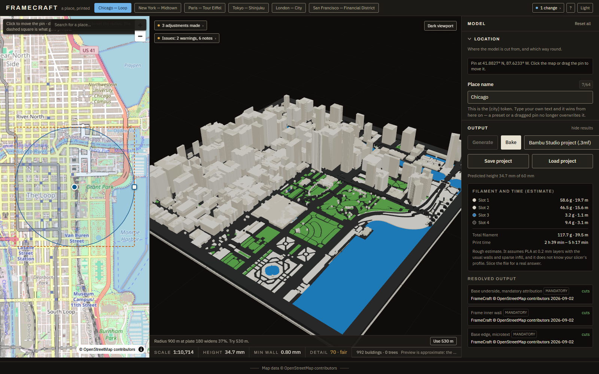
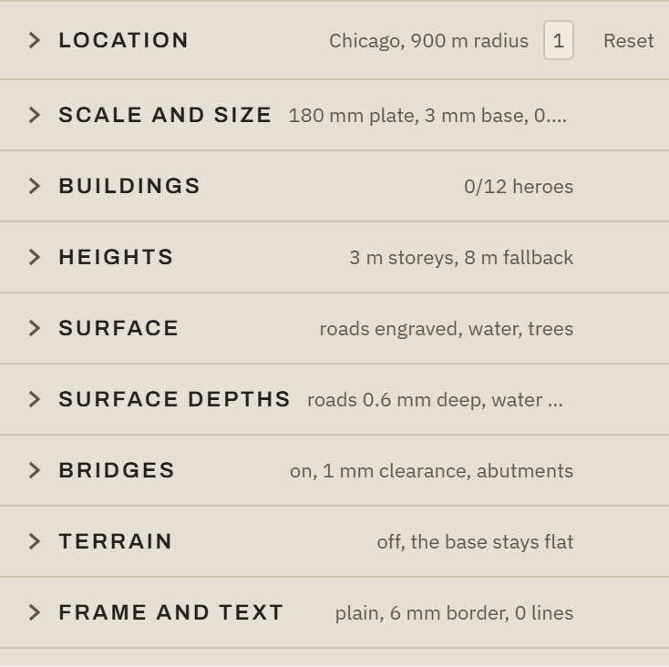
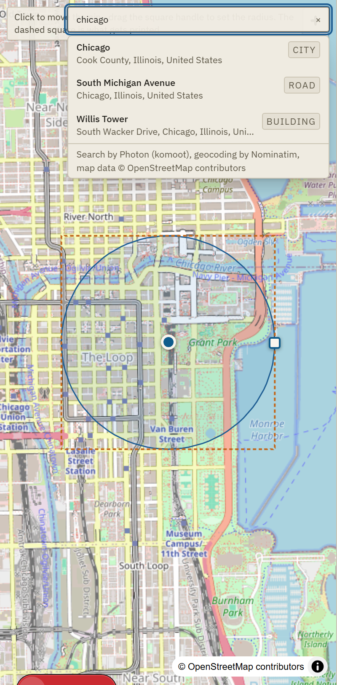
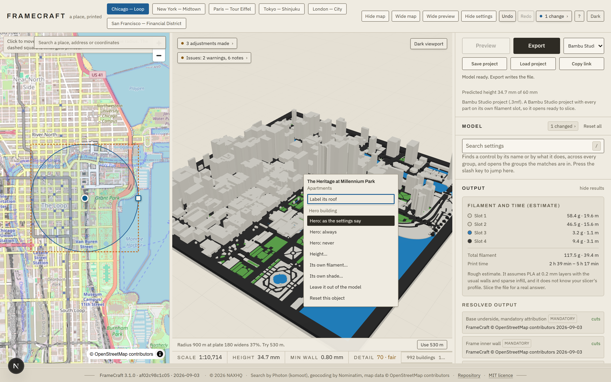
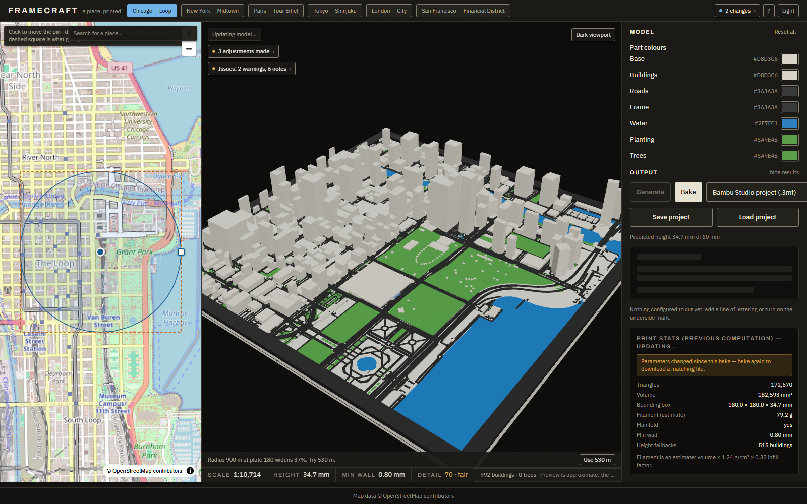

# FrameCraft

Turn any map location into a 3D-printable framed miniature city.

[](https://github.com/naxhq/framecraft/actions/workflows/ci.yml)
[](https://github.com/naxhq/framecraft/releases/latest)
[](https://github.com/naxhq/framecraft/releases)
[](LICENSE)

**Try it now: <https://naxhq.github.io/framecraft/>**



## Quick start

**Web.** Open <https://naxhq.github.io/framecraft/>, search for a place or drop
a pin, press **Preview**, tune it, then press **Export** and save the model
file your slicer wants.

**Desktop.** Download the installer for your OS from the
[latest release](https://github.com/naxhq/framecraft/releases/latest) and run
it. The same app, with a native save dialog instead of a browser download, and
`.framecraft` project files that open on double-click.

> The desktop installers are currently unsigned, so Windows SmartScreen and
> macOS Gatekeeper show a publisher warning on first launch (More info, then
> Run anyway). The build is reproducible from this repository.

## Two actions, and nothing else to learn

**Preview** fetches the location you picked and builds a model from it. Press
it after you move the pin, change the radius or pick a preset. While it runs it
turns into Cancel, and cancelling leaves the model you already had on screen.

**Export** writes the model to a file. It never writes G-code and never slices:
what you get is a solid model, and the Bambu Studio project 3MF is the one that
opens ready to slice, with every part already on its filament slot.

Everything else rebuilds on its own. Move a slider, pick a palette, change a
line of engraved text, and the model updates without being asked, because the
engine is a graph of stages and each stage knows which parameters it reads.
Changing a colour or a line of lettering re-runs a handful of stages and lands
in a fraction of a second; changing the plate size or the building heights
re-runs most of the graph and takes a few seconds. The location is the one
setting that waits for you, because it costs a network fetch.

## What you can change



- **A settings panel you can read at a glance.** Twelve groups, most of them
  closed, each with a line on its header saying what it is currently set to
  ("180 mm plate, 3 mm base, 0.4 mm nozzle"). A search box finds any control by
  name, a counter shows how many settings differ from the defaults and lists
  them, and each group resets on its own. Undo and redo cover every edit.
- **A shell you can resize.** Map, viewport and settings are three columns with
  draggable dividers. Either side can be hidden, the map or the viewport can
  take the whole window, and the layout travels with a share link or a project
  file without ever becoming a print parameter.
- **Place search that keeps up with typing.** A Photon type-ahead over
  OpenStreetMap names, plus raw coordinates parsed locally (decimal or degrees,
  minutes and seconds, in either order), your recent places, and a "use my
  location" row. Picking a result moves the pin and sets a sensible radius; it
  does not build anything until you press Preview.



- **Point at the model to ask what it is.** Hovering a building names it from
  its OSM tags. Buildings are answered exactly, from a per-triangle owner map
  that survives every boolean; roads, water and green areas are answered by the
  nearest entity in plan, and the card says so rather than overstating what it
  knows.
- **Right-click for that object's own settings.** A building can be made a
  hero, scaled, recoloured, tinted or hidden; a road can change its engraving
  mode, width or colour; a park or a water body can be raised or recoloured;
  anything can be hidden or reset. Up to 24 overrides per design, of which four
  can ask for a filament slot of their own, which is what the default printer
  profile has.



- **Bambu Studio project export.** A project 3MF with every part assigned to a
  filament slot, so it opens ready to slice. Also generic 3MF, STL (single or
  per-part zip), OBJ, faceted STEP, and a single-nozzle colour-change 3MF.
- **Terrain.** Real elevation (Mapzen Terrarium tiles) drapes the base, with
  smoothing and exaggeration controls, and fails soft to a flat base offline.
- **Hero buildings.** Pick landmarks by hand or let auto-detection score and
  select them. Heroes get their own colour region and can feed the lettering.
- **Printer profiles and a printability audit.** Eight named printers (Bambu
  H2S, P1S, X1C, A1, A1 mini, Prusa MK4, Prusa Mini, Ender 3) plus custom.
  Every model is audited (thin walls, plate and height limits, floating
  islands, overhangs, slot overruns) with one-click safe fixes where one
  exists, and a failing model is refused rather than exported.
- **Filament and time estimates.** Grams and metres per filament slot, a total,
  and a print time range, with the assumptions behind them stated.
- **Tiling.** Split a large model into an N by M grid with dovetail or pin
  registration joints, index marks, and one plate (or one file) per tile.
- **Frames.** Seven profiles, three corner styles, a sight-edge rebate, shadow
  gap, matting, a separate frame part with mounts, face textures, and cleat or
  easel hangers.
- **Colour.** Eight built-in palettes (Default plus seven) and saved custom
  palettes, per-region colours and slots, per-building tint, height gradients,
  and a contrast checker for adjacent regions.



- **Engraved lettering** on the frame and the base, with live tokens
  (`{city}`, `{coords}`, `{scale}`, `{hero}`, and more) resolved as you type.
- **Surface labels.** Name a building's roof, or the ground a street, a park or
  a water body prints as. Right-click an object to place one, drag it where you
  want it, and set the text, the cap height, engraved or raised, and whether a
  street name follows the bend. Up to twelve, each fitted to the face it sits
  on, shrunk to fit where it must be, and refused with a reason rather than
  left overhanging.
- **Projects and sharing.** Save and load `.framecraft` project files (the
  desktop app opens them on double-click, and older `.framecraft.json` files
  are migrated on load), copy a compressed permalink, and reopen recent
  designs.

## How it works

```
Overpass (OSM)  ->  SceneGraph (metres, local ENU)  ->  manifold WASM solids  ->  audited exports
     fetch            normalise + crop                  extrude, frame,           3MF / STL / OBJ /
                                                        engrave, measure          STEP + sidecar
```

All of it runs in your browser. One Web Worker holds the whole pipeline: the
Overpass fetch, the normalisation into a SceneGraph in local metres, the solid
stages on the manifold WASM boolean kernel, the printability audit, and every
exporter. The stages form a graph rather than a straight line, each one keyed
on the parameters and the upstream outputs it actually reads, so a rebuild
re-runs what changed and reuses the rest, and finished regions stream to the
viewport before the whole model is assembled. There is no FrameCraft server:
`next build` emits a static site, your design never leaves the browser, and the
only requests that go out are to OpenStreetMap's own services (Overpass, the
map tiles, Photon, Nominatim) and to the terrain tiles.

The preview and the exported file are the same meshes. There is no
lower-resolution twin drawn for the screen.

A Python reference implementation lives in `services/bake`. It is not part of
the app: it is the second implementation that keeps the transform maths honest,
and the printability validator (`make validate`) that judges exported files in
CI. `docs/ARCHITECTURE.md` has the long version.

## Printing

- **Bambu Studio**: open the exported project 3MF. Parts arrive on their
  filament slots with the printer and plate settings filled in.
- **Other slicers**: use the generic 3MF, the STL or the per-part STL zip, or
  the single-nozzle colour-change 3MF if your printer pauses on M600.

## Limitations

Known and open, rather than quietly omitted. The full ledger, with
measurements, is `docs/handoff/FAILURES.md`.

- **Tokyo** is the one preset the browser engine does not yet build to the
  reference validator's satisfaction: it fails the minimum-wall row on two of
  468 sampled regions, narrowest 0.2539 mm. Every other row passes, including
  `bodies`, `part_meshes` and `degenerate_faces`, and Chicago, New York,
  Paris, London and San Francisco all read ALL CHECKS PASS. The Tokyo case is
  measured and diagnosed, not a mystery: three acute building tips in the
  slice just under the base top, where a road ribbon stops half a metre of
  ground short of a building and leaves a rind of base beside it, and one
  0.4989 mm reading higher up that is an artefact of how the validator's own
  probe rounds corners. It has an owner and it ships as a stated limitation
  rather than as a surprise; the numbers and the repairs that were tried and
  backed out are in `docs/handoff/FAILURES.md`.
- A 256 mm plate carries residual defects on Chicago (a handful of degenerate
  faces, and one thin lobe in frame-off parts mode). The default 180 mm plate
  is unaffected and the in-app audit warns either way.
- Steep terrain can thin the base below printable width. The audit warns when
  it happens and offers the safe fixes.
- Per-building tint is visible in the preview and the OBJ export only. Other
  formats colour by region.
- STEP output is a faceted B-rep (triangle faces), not smooth CAD surfaces; a
  mesh model has no others to offer, and the app says so above 50k triangles.
- Single-nozzle colour change only recolours regions whose Z bands are
  exclusive to their slot. The rest are reported as inseparable.
- Share links cap at 8000 characters, and past that the app offers a project
  file instead.

## Map data and attribution

Map data is (c) OpenStreetMap contributors, licensed under the
[ODbL](https://opendatacommons.org/licenses/odbl/1-0/). Every model FrameCraft
builds carries engraved attribution marks and file metadata naming the source;
when you share a photo or a print, credit "(c) OpenStreetMap contributors".
Details, obligations, and what the marks do and do not achieve:
[LICENSE_AND_ATTRIBUTION.md](LICENSE_AND_ATTRIBUTION.md).

The FrameCraft source code is MIT licensed, copyright (c) 2026 NAXHQ (see
[LICENSE](LICENSE)); the map data it processes remains under the ODbL.

## Development

See [CONTRIBUTING.md](CONTRIBUTING.md) for setup, tests, and the rules that
keep the contracts and the gate honest. `RUNBOOK.md` has the commands,
`docs/ARCHITECTURE.md` describes the system, `DECISIONS.md` records why it is
the way it is, and `CHANGELOG.md` records what changed when.

The screenshots above are captured from the running app, never drawn:

```sh
cd apps/web && node scripts/capture-screenshots.mjs
```

---

FrameCraft 3.1.0. (c) 2026 NAXHQ. Map data (c) OpenStreetMap contributors.
Search by Photon (komoot), geocoding by Nominatim, terrain from Mapzen
Terrarium tiles on AWS Open Data.
